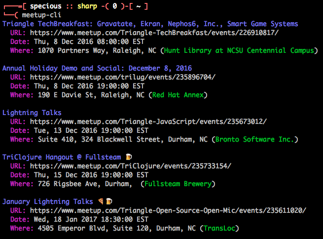

# meetup-cli

Tired of meetups clogging up your inbox? Track and share your upcoming [Meetup.com](https://www.meetup.com/) events using this command line tool.

Get it: `gem install meetup-cli` *(might require sudo)*

# What can you do with it?

By default, it shows your upcoming meetups:



# What else does it do?

Show upcoming meetups you're going to:

```
meetup-cli
```

Show upcoming meetups you're not going to:

```
meetup-cli notgoing
```

Show meetups you went to in reverse chronological order:

```
meetup-cli went
```

Show all the commands:

```
meetup-cli --help
```

# Objective

This project aims to make some of Meetup API’s functionality available through an easy-to-use command line interface.

# Want to help?

Contributions are welcome. Please check the [issues](https://github.com/specious/meetup-cli/issues) and feel free to open a pull request.

# License

ISC